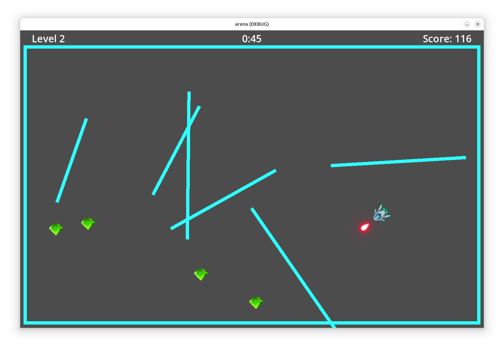

# Arena



## Overview

Arena is a simple video game written using Godot 4.3 and GDScript.  You can play the game from the keyboard, or attempt to write an agent in GDScript that plays the game automatically.

The game should run on any platform that Godot supports, e.g. Linux, macOS, or Windows.

## Running the game

1. Install Godot 4.3.
2. Clone this repository.
3. Start Godot.  The Project Manager will appear.  Click the Import button, then navigate to the directory that you cloned the repository into.  Click "Select Current Folder", then click "Import & Edit".
4. The game will now be open in the Godot editor.  To run the game, click the triangle button in the toolbar at the top of the window.

## Gameplay

The game consists of a series of levels, each containing walls and gems.  Once you collect all the gems on any level, you will advance to the next level.  The levels become progressively harder: level 1 has 5 walls and 5 gems, and each level after that has one more wall and one more gem.  On every level there is a 60-second time limit.  If you fail to collect all gems within 60 seconds, the game ends.

To control your ship from the keyboard, press the left or right arrow keys to rotate.  You can thrust forward by pressing Ctrl, Shift, A, or Z.  If you hit a wall, you will bounce off it and lose some of your velocity.

You begin with one missile, and gain an additional level after completing every two levels (i.e. on levels 3, 5, and so on).  To fire a missile, press the space bar.  It will destroy any interior wall it hits.  (The side walls around the edges of the screen cannot be destroyed).

You gain 10 points for each gem that you collect.  Also, if you finish a level before the 60-second time limit is up then you gain one point for every remaining second on the clock.

## Writing an agent

To write an agent in GDScript, edit the file `agent.gd` in this source distribution.  You will need to set the Use Agent property (see below) to make your agent active when you run the game.

In `agent.gd` you will need to implement the action() method, which the game calls on every tick to find out what your agent wants to do.  action() takes four arguments:

* `walls: Array[PackedVector2Array]`

  An array containing the positions of walls on the level.  Walls are always rectangular.  Each wall position is a `PackedVector2Array` containing four `Vector2` objects representing the coordinate of the wall's four vertices.

* `gems: Array[Vector2]`

  An array containing the center positions of all gems.

* `polygons: Array[PackedVector2Array]`

  A navigation mesh representing open space in the level.  The mesh includes all space that is at least `ship.RADIUS` pixels from any wall.  The ship's collision area is a circle with this radius, so this guarantees that the ship can navigate to any point in the mesh without a wall collision.

  The mesh consists of a set of polygons, indexed from 0.  `polygons[i]` holds the geometry of the `i`-th polygon in the mesh, represented as a `PackedVector2Array` containing the coordinates of all vertices in the polygon in order.  Each vertex position is represented as a `Vector2`.

* `neighbors: Array[Array]`

  This argument is an array of arrays of integers.  (Really it should have type `Array[Array[Int]]`, but GDScript in Godot 4.3 does not support nested array types, so this type is the best possible approximation.)  It represents a graph showing how the polygons in the navigation mesh are connected.  For any `i`, `neighbors[i]` is a list of indices of the neighbors of polygon `i`.  The graph is undirected, so if `neighbors[i]` contains `j`, then `neighbors[j]` will always contain `i` as well.

The action() method must return an array containing three elements:

* An integer (either -1, 0, or 1) indicating whether the ship should rotate leftward, not rotate, or rotate rightward on this tick.

* A boolean which is true if the ship should thrust forward on this tick.

* A boolean which is true if the ship should fire a missile on this tick.

### Global variables

At the top of agent.gd, a couple of useful global variables are defined:

* `ship` is the Godot object representing the player's ship.  It is a `CharacterBody2D` which has many attributes.  The most useful of these are
    - `ship.position` (Vector2): the ship's current position
    - `ship.velocity` (Vector2): the ship's current velocity in pixels per second
    - `ship.rotation` (float): the ship's rotation in radians, where 0 points rightward
    - `ship.ACCEL` (int): a constant representing the ship's acceleration in pixels per second squared whenever it thrusts forward
    - `ship.ROTATE_SPEED` (int): a constant representing the ship's rotational speed in radians per second whenever it rotates
    - `ship.RADIUS` (int): a constant representing the radius of the ship's collision area in pixels

  You __should not modify__ any of these ship attributes in your agent code.  The game will update them automatically based on the actions you return from the action() method.

* `debug_path` is a `Line2D` object that can display a path consisting of a series of line segments.  If your agent calculates a path to follow, you can use `debug_path` to display it for debugging purposes.  To do so, call these methods:

    - `debug_path.clear_points()`: clear all points in this path
    - `debug_path.add_point(p: Vector2)`: add a point to the path

  The path will only be visible when you set the Show Path property (see below).

### Notifications

agent.gd contains a couple of notification methods that the game calls when certain events happen:

* bounce() is called every time the agent has bounced off a wall.

* gem_collected() is called each time the agent has collected a gem.

The default implementations of these methods do nothing.  You may modify them as you like.

## Game properties

In the Godot editor, if you click on the top-level node ("arena") in the Scene tree on the left then the Inspector (on the right) will display various properties that you can edit:

* Use Agent (default = false): When true, the agent controls the game automatically.  When false, the user controls the game from the keyboard.

* Random Seed (default = -1): If this is -1, the game will use different random values each time it runs.  You can set this to a non-negative seed value, in which case all wall and gem positions will be the same in every game.  This may be useful for debugging.

* Starting Level (default = 1): Set this to a higher value if you want the game to begin on a more difficult level.

* Show NavMesh (default = false): If true, the game will display the navigation mesh for debugging purposes.

* Show Path (default = false): If true, the game will display any path that you have set in `debug_path` as described above.

## Running from the command line

You can run the game from the command line.  To do so, open a terminal window in the project directory and run

```
$ godot
```

The game accepts an argument `-seed` that specifies a random seed for the game.  You should include `--` before `-seed`, so that Godot will interpret this as an argument to be passed to the program itself.  For example:

```
$ godot -- -seed 2
```

Additionally you may specify a range of seeds such as `1:5`, in which case the game will automatically run repeatedly, once for each seed in the given range.  After all games are complete, the program will report the average score achieved over all games.

When you specify one or more seeds, the game will always be controlled by the agent, not by the keyboard.

You can specify the Godot argument `--fixed-fps` to run a simulation at high speed.  The game's usual rate is 60 fps (frames per second).  Specify a __smaller__ number to run the game more quickly.  For example, `--fixed-fps 30` will run the game at double speed.  `--fixed-fps 2` will run the game at 30 times normal speed.  This is convenient for running a batch of simulations.  For example:

```
$ godot --fixed-fps 2 -- -seed 1:5
```


## Notes

The file `util.gd` contains a couple of utility methods that may be helpful for writing an agent.

Currently the ship's position is not always guaranteed to be in contained in some navigation mesh polygon.  That's because the navigation mesh excludes areas that are close to walls, and it's sometimes possible for the ship to be just inside those areas, a pixel or two away from any navigation mesh polygon.

## Author

Adam Dingle, adam.dingle@mff.cuni.cz
